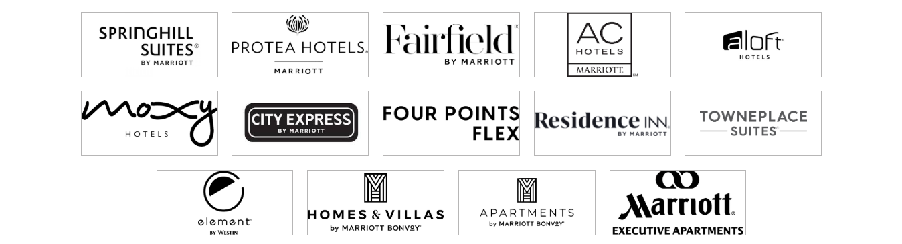

# **Marriott Bonvoy - Our Brands Page**

This repository contains the code for the **Marriott Bonvoy - Our Brands** webpage. The page is built entirely using **HTML** and **CSS**, focusing on a clean design, smooth navigation, and responsive layout. Users can explore the diverse Marriott Bonvoy brands with an intuitive interface.

---

## 🌟 **Features**

1. **Navigation Bar**:
   - Links to essential sections, including:
     - **Find & Reserve**
     - **Deals & Packages**
     - **Meetings & Events**
     - **Our Brands**
     - **Credit Cards**
     - **About Marriott Bonvoy**
     - **Help Home**
   - Displays the **Marriott Bonvoy logo** for consistent branding.

2. **Hero Section**:
   - **Grid of brand logos** that highlights Marriott Bonvoy's portfolio of hotel brands.
   - Logos organized into categories such as:
     - **Luxury Brands**: The Ritz-Carlton, St. Regis, W Hotels, etc.
     - **Premium Brands**: Marriott Hotels, Sheraton, Delta Hotels, etc.
     - **Select Brands**: Courtyard, Fairfield Inn, Aloft, etc.
   - Fully responsive layout, ensuring an optimal experience across all screen sizes.

3. **Fully Static Design**:
   - Built entirely with **HTML5** and **CSS3**, avoiding JavaScript for simplicity.
   - Hover effects enhance interactivity.

---

## 🛠️ **Technologies Used**

- **HTML5**: For semantic structure and content organization.
- **CSS3**: For styling, layout, and responsiveness.

---

## 📂 **Project Structure**

```
root/
├── index.html        # Main HTML file for the webpage.
├── style.css         # Stylesheet for layout, colors, and responsiveness.
├── Images/           # Folder for logo images and other assets.
├── README.md         # Documentation file for the project.
```

---

## 🖼️ **Output Preview**

### 1. **Navigation Bar**


### 2. **Hero Section**
- **Grid of Brand Logos**  



---

## 🚀 **How to Run Locally**

1. **Clone this repository**:
   ```bash
   git clone https://github.com/PriyaMaity/Our-Brands.git
   ```

2. **Navigate to the project folder**:
   ```bash
   cd our-brands
   ```

3. **Open the `index.html` file**:
   - Double-click `index.html` to launch it in your default web browser.

---

## ✨ **Future Enhancements**

- Add **category descriptions** for each brand.
- Include links for more details about each brand.
- Improve layout for **large screens** with advanced CSS grid/flexbox features.

---

## 👩‍💻 **Author**

- **Priya Maity**  
  GitHub: [Priya Maity](https://github.com/PriyaMaity)  
  LinkedIn: [Priya Maity](https://www.linkedin.com/in/priya-maity-2a661430a/)  

---