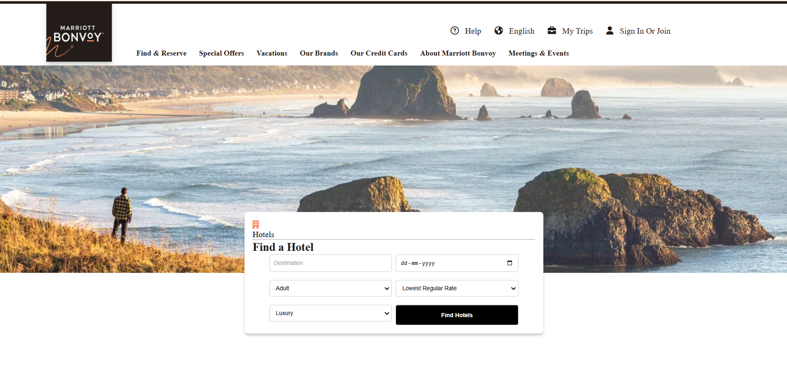
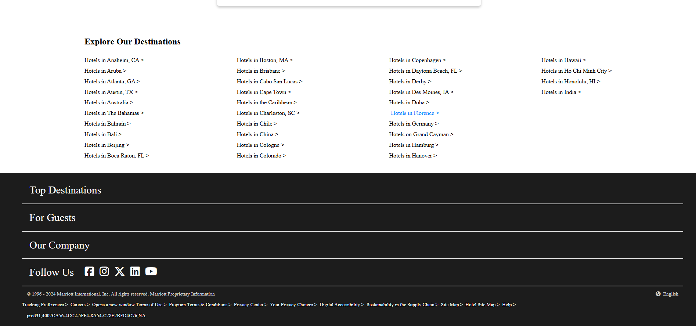

# 🏨 Find a Hotel Page  

## 🌟 Overview  
The **Find a Hotel** page is part of a collaborative team project to create a user-friendly **Marriott Bonvoy Hotels**.  

This page provides users with the ability to:  
✅ Search for hotels based on destination or preferences.  
✅ View available rooms and their details.  
✅ Select check-in and check-out dates for hotel bookings.  

The page is designed with simplicity and functionality in mind, using **HTML** and **CSS** to deliver a clean and responsive user experience.

---

## ✨ Features  
- 🔍 **Hotel Search**:  
  - Users can easily search for hotels by entering their desired destination or city name.  
- 🛏️ **Room Details**:  
  - View detailed information about available rooms, including room types, availability, and prices.  
- 📅 **Date Selection**:  
  - Filter hotel search results by selecting check-in and check-out dates.  

---

## 💻 Technologies Used  
| **Technology** | **Purpose** |  
|----------------|-------------|  
| 🌐 HTML        | To structure the web page layout. |  
| 🎨 CSS         | To style and enhance the appearance of the page. |  

---

## 🚀 How to Use  
### 1. Clone the Repository:  
```bash  
git clone https://github.com/PriyaMaity/Jw-Marriot.git 
```  

### 2. Navigate to the Project Directory:  
```bash  
cd your-repo-name  
```  

### 3. Open the `index.html` File:  
- Open the `index.html` file in any modern web browser to view and interact with the page.  

---

## 🖼️ Preview  
Here’s a quick glimpse of how the **Find a Hotel** page looks:  


## 🧑‍💻 Authors  
- **Rohit Shaw** - *Find a Hotel page design and functionality*  
