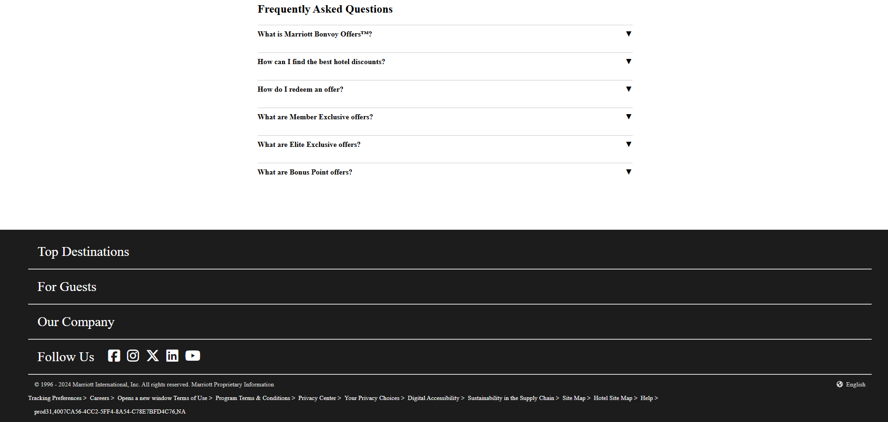

# Marriott Bonvoy Special Offers Webpage

A responsive website showcasing special offers, member-exclusive deals, and travel benefits for Marriott Bonvoy members. This project aims to provide a user-friendly platform for users to explore and access various Marriott Bonvoy promotions and offers.

## 🖥️ Features

- **Responsive Navigation Bar**: Access all sections with ease, including Find & Reserve, Special Offers, Vacations, and more.
- **Animated Hero Section**: Welcomes users with engaging animations.
- **Exclusive Offers**: Special deals for members and popular offers.
- **Membership Section**: Encourages users to join Marriott Bonvoy with exclusive benefits.
- **Explore the World**: Highlights travel deals and unique experiences.
- **FAQs**: Common questions about Marriott Bonvoy Offers answered clearly.
- **Footer**: Links to top destinations, company information, and social media platforms.

## 🛠️ Technologies Used

- **HTML5**: For structuring the content.
- **CSS3**: For styling and animations.
- **Font Awesome**: For adding icons to enhance the visual appeal.

## 📂 Project Structure

```
Project Directory
├── index.html         # Main HTML file for the webpage
├── style.css          # CSS file for styling
├── findpic/           # Folder containing images for the website
└── README.md          # Documentation file
```

## 📸 Screenshots

### Hero Section
)

### Member Exclusive Offers
)

### Popular Offers
)

### Explore the World
)


## 🧰 Setup Instructions

1. Clone the repository:
   ```bash
   git clone https://github.com/PriyaMaity/Jw-Marriot.git
   ```
2. Navigate to the project directory:
   ```bash
   cd marriott-bonvoy-offers
   ```
3. Open the `index.html` file in your browser to view the website:
   ```bash
   open index.html
   ```

## 💬 Feedback

If you have any feedback or suggestions, please feel free to reach out or open an issue in this repository.
