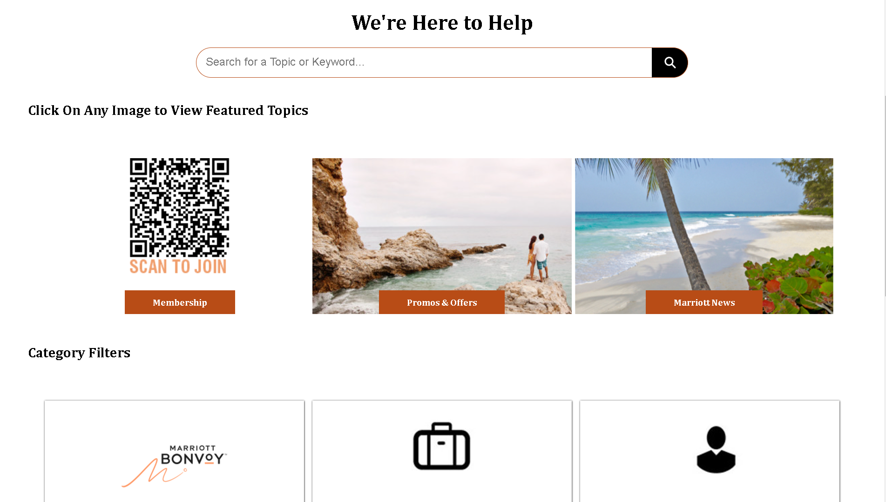
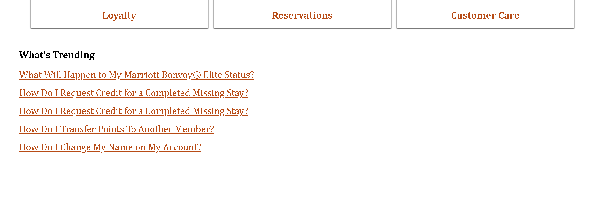

# 🌐 Marriott Bonvoy Website  
**🚀 Live Demo**: [Marriott Bonvoy Website](#)  

## 📝 Overview  
The Marriott Bonvoy project is a comprehensive website developed as part of **Geekathon**, showcasing the seamless collaboration of a 5-member team. The website replicates the user interface of Marriott's official site, focusing on **responsiveness**, **interactivity**, and a **professional design**.  

## 🎉 About Geekathon  
This project was created during **Geekathon**, an innovative event by Geekster. Geekathon provides an excellent platform for aspiring developers to foster collaboration, learn practical web development skills, and solve real-world problems.  

## 📂 Technologies Used  
- **HTML5**  
- **CSS3**  
- **Responsive Design**  

---

## 🎯 Team Contributions  

### 👩‍💼 **Team Leader: Priya Maity**  
- **Landing Page (Home Page)**  
  - [GitHub Repository](https://github.com/PriyaMaity/Jw-Marriot)  
  - Screenshot: 
  
- **Our Brands Page**  
  - [GitHub Repository](https://github.com/PriyaMaity/Jw-Marriot/tree/main/Project%20Marriott/Priya-OurBrands)  
  - Screenshot: 
  
   
    
- **Help Page**  
  - [GitHub Repository](https://github.com/PriyaMaity/Jw-Marriot/tree/main/Project%20Marriott/Help)  
  - Screenshot:
  
  
  
  
  

### 🧑‍💻 **Pratik Yasare**  
- **Meeting & Events Page**  
  - [GitHub Repository](#)  
  - Screenshot: *(To be added after this section)*  
- **Sign In or Join Page**  
  - [GitHub Repository](#)  
  - Screenshot: *(To be added after this section)*  
- **My Trip Page**  
  - [GitHub Repository](#)  
  - Screenshot: *(To be added after this section)*  

### 🧑‍💻 **Rohit Shaw**  
- **Find Reserve Page**  
  - [GitHub Repository](https://github.com/PriyaMaity/Jw-Marriot/tree/main/Project%20Marriott/Rohit-FindReserve)  
  - Screenshot: 
  
- **Special Offers Page**  
  - [GitHub Repository](https://github.com/PriyaMaity/Jw-Marriot/tree/main/Project%20Marriott/Rohit-SpecialOffers)  
  - Screenshot: )
  )
  )
  )

### 🧑‍💻 **Aniket Raikar**  
- **Our Credit Cards Page**  
  - [GitHub Repository](#)  
  - Screenshot: *(To be added after this section)*  
- **Vacation Page**  
  - [GitHub Repository](#)  
  - Screenshot: *(To be added after this section)*  

### 🧑‍💻 **Bikal Limbu**  
- **About Marriott Bonvoy Page**  
  - [GitHub Repository](#)  
  - Screenshot: *(To be added after this section)*  

---

## 📜 Features  
- 🌟 **Fully Responsive Design** for various devices.  
- 🌟 **Interactive Pages** tailored for user engagement.  
- 🌟 **Collaborative Work** reflecting team efforts.  

---

## 🌐 Main Repository  
[Marriott Bonvoy - GitHub Repository](https://github.com/PriyaMaity/Jw-Marriot)  

---

## 📸 Screenshots  
- **Landing Page** by *Priya Maity*  
  
  
  
  
  
  
  
  
  
  
  
- **Meeting & Events Page** by *Pratik Yasare*  
  *(Add Screenshot Here)*  
- **Find Reserve Page** by *Rohit Shaw*  
  *(Add Screenshot Here)*  
- **Our Credit Cards Page** by *Aniket Raikar*  
  *(Add Screenshot Here)*  
- **About Marriott Bonvoy Page** by *Bikal Limbu*  
  *(Add Screenshot Here)*  

---

## 🙌 Acknowledgements  
Special thanks to **Geekathon** for providing this wonderful opportunity to showcase our skills and teamwork.  

---

## 📞 Contact  

### 👩‍💼 **Team Leader: Priya Maity**  
- 🌐 [GitHub Profile](https://github.com/PriyaMaity)  
- 🔗 [LinkedIn](https://www.linkedin.com/in/priya-maity-2a661430a/)  

### 🧑‍💻 **Team Members**  
- **Pratik Yasare**  
  - 🌐 [GitHub Profile](#)  
  - 🔗 [LinkedIn](#)  
- **Rohit Shaw**  
  - 🌐 [GitHub Profile](#)  
  - 🔗 [LinkedIn](#)  
- **Aniket Raikar**  
  - 🌐 [GitHub Profile](#)  
  - 🔗 [LinkedIn](#)  
- **Bikal Limbu**  
  - 🌐 [GitHub Profile](#)  
  - 🔗 [LinkedIn](#)  

---
